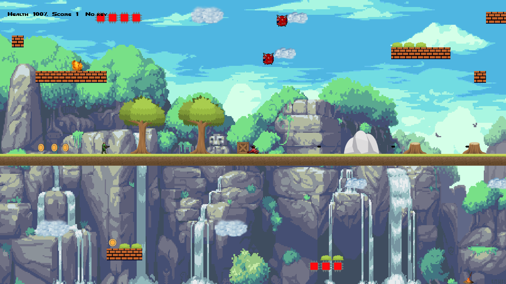
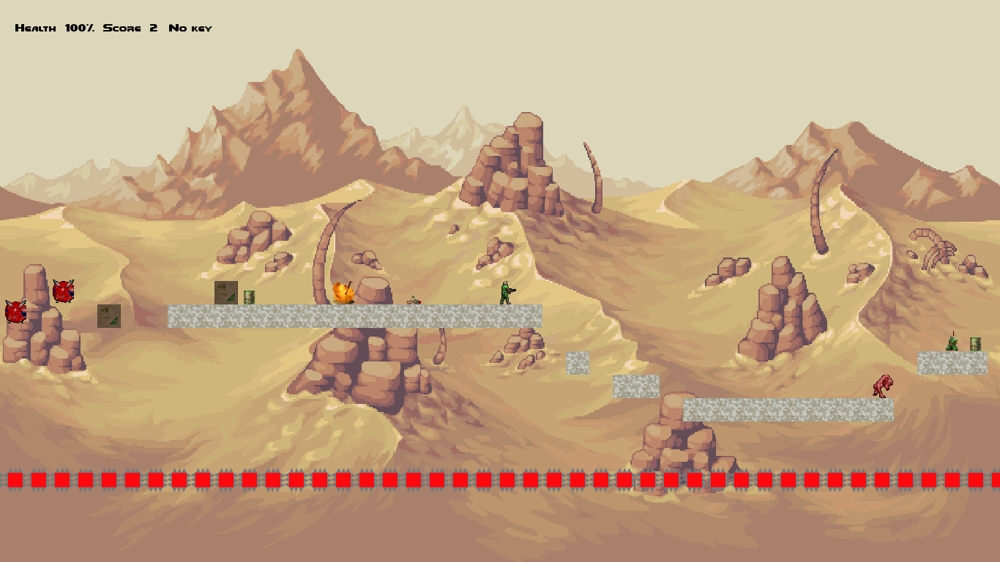

# SuperDooMGuy
Small platformer with tiled graphics, powered by pygame. Inspired by SuperMeatBoy and DooM.

## Requirements:
* pygame
* pyganimation
* pytmx

## Frozen version
You can download frozen version in SFX-archive [here](https://drive.google.com/open?id=1-R8h--be_o9XbnsXG70RWN2W6maHm25W).

_Some notices:_
- The game may not work properly if the address contains cyrillic characters!
- If you get Runtime Error try to install Microsoft Visual C++ Redistributable from game_folder/redist/ according to your OS.

## Screenshots:

